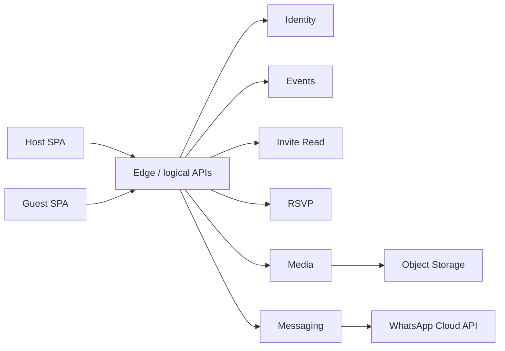

# Invana

Premium event invitations, RSVP sites, and bio cards — React + Vite + TypeScript.

**Demo Mode** (default): drafts, RSVPs, and shares use `localStorage` and `wa.me` when Supabase env is empty.  
**Connected Mode**: set Supabase publishable URL/key → Auth, Postgres persistence, Storage, and optional WhatsApp Cloud API via Edge Functions.

## Quick start

```bash
npm install
npm run dev
```

Open the URL Vite prints (usually `http://localhost:5173`).

```bash
npm run build      # typecheck + production build
npm run preview    # serve dist/
npm run lint
npm run typecheck
npm test
```

## Product flow

1. **Create** → defaults to **Invitation + Wedding** (`/create` → `/create/wedding`); switch occasion or open **Create card** anytime  
2. **Template** → choose an original composition  
3. **Builder** → short form + expandable More details, theme, live SVG preview  
4. **Export** → PNG / PDF  
5. **Publish** → public `#/invite/:slug` page (countdown + map CTA when data is present)  
6. **Share** → WhatsApp via `wa.me` (or Cloud API when configured)  
7. **RSVP** → guests respond; counts on **My events**

---

## Architecture

Invana is a **host → invite → guest** product. The browser SPA never holds privileged secrets. Connected Mode uses Supabase Auth + Postgres (RLS) + Storage, with Edge Functions as logical services (Phase 1). Demo Mode stays fully local.

Canonical content model:

```
RenderInput = fields + templateId + theme (+ sections)
        │
        ├─ Composition (SVG) → live preview, PNG, PDF
        └─ InvitePage (React) → responsive RSVP site
```

Backend stores that JSON; it does not re-implement template layout.

### Actors

| Actor | Needs from backend |
|-------|-------------------|
| **Signed-in host** | Persist drafts/published events (`config` = `RenderInput`), upload photos, publish slug, see RSVPs, share via WhatsApp |
| **Browser-session host** (Connected, not signed in) | Edit locally; **must not** invent durable cloud state until auth; on sign-in, promote local draft + re-upload local media |
| **Guest** (no account) | Load published invite by slug; submit RSVP; load public media |
| **Host download** | PNG/PDF must embed the **same durable photo URLs** that the live invite uses (not ephemeral `blob:`) |

### Design principles

1. **Bounded contexts** — split by who owns writes and failure domains, not one service per table.  
2. **Shared-nothing data ownership** — one system of record per aggregate.  
3. **Public vs privileged APIs** — guest paths anonymous + rate-limited; host paths require JWT.  
4. **Durable media first** — publish/export image fields must be HTTPS object storage URLs, never `blob:`/`data:`.  
5. **Sync for request/response; async for fan-out** — invite GET and RSVP insert stay sync; WhatsApp bulk / webhooks / email can be async.  
6. **Evolve from Supabase** — logical Edge services first; extract deployables when load or team boundaries demand it.  
7. **Keep FE adapters** — `PersistenceProvider` / `StorageProvider` / `AuthProvider` / `MessagingProvider` stay the client contracts.

### FE adapters

| Interface | Demo Mode | Connected Mode |
|-----------|-----------|----------------|
| `PersistenceProvider` | `localStorage` | Supabase `events` / `rsvps` (host CRUD via PostgREST) |
| `AuthProvider` | local demo user | Supabase Auth (magic link) |
| `MessagingProvider` | `wa.me` | `wa.me` by default; Cloud API when `VITE_MESSAGING_MODE=cloud` |
| `StorageProvider` | durable data URLs | Media Edge (preferred) or Storage `event-media` public URLs; promote local media on Save/claim |

`src/services/index.ts` selects Demo when `VITE_SUPABASE_URL` / publishable key are unset. Public guest paths prefer Edge APIs (`src/services/api/*`) with PostgREST fallback until functions are deployed.

### Logical services (Phase 1)

| Service | Responsibility | Data owned | Edge Function |
|---------|----------------|------------|---------------|
| **Identity** | Signup/signin, JWT, profile | `profiles` | Supabase Auth |
| **Events** | Draft/publish, slug, `config` SoR | `events`, `themes` | `events` (publish/unpublish) |
| **Invite Read** | Public GET by slug | None (projection of Events) | `invite` |
| **RSVP** | Guest insert; host list | `rsvps` (+ questions/answers later) | `rsvp` |
| **Media** | Upload, metadata, durable URLs | `event_media` + `event-media` bucket | `media` |
| **Messaging** | WhatsApp send/webhooks | `message_*` | `whatsapp-send`, `whatsapp-webhook` |
| **OG** | Crawler HTML shell | — | `og-invite` |
| **Jobs** *(later)* | Bulk send, email, OG/export | `outbox_events` / queue | — |
| **Export** *(optional)* | Server PNG/PDF | `exports` | Client `lib/export.ts` for now |

### Product API surface

**Host (JWT):**

- `GET/POST/PATCH/DELETE /v1/events…`
- `POST /v1/events/{id}/publish` · `POST …/unpublish`
- `GET /v1/events/{id}/rsvps` · `GET /v1/rsvps?eventIds=`
- `POST /v1/media/uploads`
- `POST /v1/messaging/campaigns` · `POST …/send`
- `GET /v1/me`

**Public (anon + rate limit):**

- `GET /v1/invites/{slug}` → published projection  
- `POST /v1/invites/{slug}/rsvps` → insert only  
- `GET /v1/media/…` via public bucket (CDN)

**System:** `POST /v1/webhooks/whatsapp` · internal workers (not browser-callable)

Mapped today to Supabase Functions (`/functions/v1/<name>`). Host CRUD may still use PostgREST behind `PersistenceProvider`; treat the routes above as the product API for future extraction.

### Auth & session

| Mode | Behavior |
|------|----------|
| **Signed-in** | JWT on every host mutation; RLS / service-enforced `user_id` |
| **Browser-session only** | Local draft OK; Publish / Share / Download gated; no silent cloud write as `unauthenticated` |
| **Guest** | No auth; invite + RSVP only |
| **Promotion on sign-in** | Rebind local `userId`; re-upload `blob:`/`data:` field URLs to Media; upsert Events |

### Media invariant

- Bucket: **public-read** `event-media` (Phase 1 default).  
- Writes: owner-only; MIME/size checks at Media Edge.  
- After save-for-publish, every image field in `config` is a durable HTTPS URL. Export and invite both consume that URL.  
- Binaries never live in Postgres — only `event_media` metadata.

### Invite & RSVP

- Slug uniqueness global; normalize on write; conflict → 409.  
- RSVP insert allowed only when `status=published`.  
- Guests cannot `SELECT` other RSVPs.  
- Connected Mode: cloud is SoR — **no silent local-only fallback** on RSVP failure. Demo Mode may stay local.

### Data ownership

| Aggregate | Owner | Others may |
|-----------|-------|------------|
| User/profile | Identity | Read `user_id` |
| Event + slug + config | Events | Invite reads published projection; RSVP holds `event_id` |
| Media object + metadata | Media | Events stores URL strings in `config` |
| RSVP (+ answers) | RSVP | Events does not embed RSVP arrays |
| Campaigns / logs | Messaging | References `event_id`, `guest_id` |

### Phased migration

| Phase | Status | Focus |
|-------|--------|--------|
| **0** | Done | Cloud RSVP SoR; durable media before publish; Demo Mode local |
| **1** | Done (logical services) | Edge `invite` / `rsvp` / `media` / `events` / `og-invite`; request IDs; rate limits; outbox table |
| **2** | Later | BFF; extract Messaging/Media workers |
| **3** | Only if needed | Independent deployables; server Export |

**Non-goals (early):** rewrite Composition into the backend; custom auth server; one microservice per SQL table; dropping Demo Mode.

### Topology (logical)



### Defaults (open decisions)

| Topic | Choice |
|-------|--------|
| Media visibility | Public bucket |
| Download gate | Sign-in required in Connected Mode (`VITE_REQUIRE_SIGN_IN` default true) |
| Server export | Deferred — client PNG/PDF + durable URLs |
| BFF host | Supabase Edge for Phase 1 |
| RSVP notifications | Dashboard-only; `outbox_events` written, no email worker yet |
| OG | `og-invite` Edge function; CDN/bot proxy wiring later |

### Repo layout

- `src/pages` — routes (marketing, wizard, builder, invite)  
- `src/components/editor` · `invitation` · `seo`  
- `src/templates` — registry + factories  
- `src/lib/render` · `export` · `mediaUrl` · `durableMedia` · `supabase`  
- `src/services` — provider interfaces + demo / supabase adapters  
- `src/services/api` — Edge logical API clients  
- `supabase/` — migrations, RLS, Storage policies, Edge Functions  
- `docs/deployment.md` · `docs/whatsapp.md` · [REQUIREMENTS.md](REQUIREMENTS.md) · [supabase/README.md](supabase/README.md)

---

## SEO notes

Canonical site: **https://invana.stream**. Per-route `document.title`, description, keywords, and Open Graph / Twitter tags are applied via `Seo` / `usePageMeta` (`src/seo/`). `index.html`, `public/robots.txt`, and `public/sitemap.xml` provide crawler fallbacks. Netlify SPA fallback (`netlify.toml` / `public/_redirects`) keeps `/invite/:slug` and other path routes crawlable.

Invite pages update meta client-side after the event loads. Link-preview bots that only read the static HTML shell still see homepage OG tags — use Edge `og-invite` (and a CDN rewrite) for WhatsApp/Facebook share cards.

## Environment

Copy `.env.example`. Leave Supabase vars empty for Demo Mode:

```
VITE_SUPABASE_URL=
VITE_SUPABASE_PUBLISHABLE_KEY=
VITE_MESSAGING_MODE=          # demo | wa_me | cloud
VITE_PUBLIC_SITE_URL=https://invana.stream   # local: http://localhost:5173
VITE_GA_MEASUREMENT_ID=       # optional GA4 (G-XXXXXXXX)
```

Never put service-role keys, WhatsApp tokens, or other secrets in `VITE_*` vars.

## Enable Connected Mode

1. Create a Supabase project.  
2. Run SQL migrations in order (see [supabase/README.md](supabase/README.md)):
   - `supabase/migrations/20260324000000_init.sql`
   - `supabase/migrations/20260324000001_rls.sql`
   - `supabase/migrations/20260324000002_storage.sql`
   - `supabase/migrations/20260326000000_phase1_api.sql`
3. Deploy Edge Functions: `invite`, `rsvp`, `media`, `events`, `og-invite` (plus WhatsApp when needed).  
4. Enable **Email** auth (magic link) in Supabase Auth.  
5. Copy Project URL + **anon/publishable** key into `.env`:

```
VITE_SUPABASE_URL=https://YOUR_PROJECT.supabase.co
VITE_SUPABASE_PUBLISHABLE_KEY=eyJ...
VITE_PUBLIC_SITE_URL=http://localhost:5173
```

6. Restart `npm run dev`. The app switches adapters automatically (`modeLabel()` → Connected).  
7. Sign in via magic link before cloud Save / Publish.  
8. Optional WhatsApp Cloud: deploy Edge Functions, set secrets, then `VITE_MESSAGING_MODE=cloud` ([docs/whatsapp.md](docs/whatsapp.md)).

Until Edge Functions are deployed, the SPA falls back to PostgREST for invite GET / RSVP insert / Storage upload.

## Hosting

| Target | Notes |
|--------|--------|
| **Netlify (production)** | https://invana.stream — `netlify.toml` + `public/_redirects` SPA fallback |
| **Vercel** | `vercel.json` SPA rewrites — [docs/deployment.md](docs/deployment.md) |
| **GitHub Pages** | Existing workflow; hash routes (legacy) |

### GitHub Pages

1. Repo **Settings → Pages → Source: GitHub Actions**  
2. Push to `main` (or `master`) — workflow lint → typecheck → build → deploy  
3. Enable Pages; the workflow copies `index.html` to `404.html` for path fallbacks

Project pages work with relative `base: './'` and hash routes (`/#/invite/slug`).

## Scripts & stack

- React 18, Vite 5, Tailwind 3, Zod, jsPDF, qrcode, `@supabase/supabase-js`, Vitest  
- Editorial UI: Playfair / Cormorant + Inter, cream / gold / ink  

## License note

Templates are original Invana compositions (see each template’s `license` metadata). Do not paste third-party Canva/Pinterest artwork.
