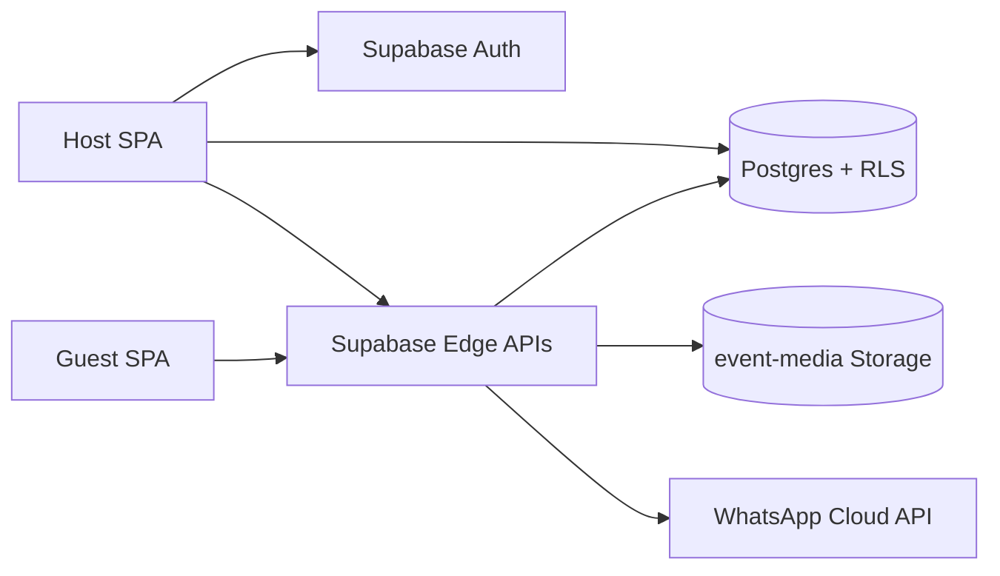

# Invana

Invana is a mobile-first platform for creating premium digital invitations and
bio cards, exporting print-ready PNG/PDF files, publishing RSVP websites, and
sharing invitations through WhatsApp.

The current catalog contains **101 original templates**, **15 invitation event
types**, **10 bio/card types**, and **6 client-side theme presets**.
The npm package is currently named `event-invite-platform`; **Invana** is the
user-facing product name.

| Mode | Behavior |
|------|----------|
| **Demo** | Browser-local drafts/RSVPs, compressed data-URL photos, and `wa.me` shares; no backend required |
| **Connected** | Supabase email/password Auth, Postgres + RLS, Storage, Edge APIs, and optional WhatsApp Cloud API |

Production site: **https://invana.stream**

---

## What is implemented

- Invitation and bio-card creation across 15 event types and 10 card types.
- Original, data-driven SVG templates with theme customization and live preview.
- Photo slots with center cover-crop in builder, public invite, PNG, and PDF.
- Client-side photo compression, a 2 MB stored-object limit, and long-lived CDN caching.
- Automatic Storage cleanup when photos are replaced/removed or an event is deleted.
- PNG and PDF export with Storage photos embedded for reliable downloads.
- Public invitation URLs, QR codes, RSVP submission, and host RSVP dashboards.
- Demo Mode for zero-config use and Connected Mode for durable multi-device data.
- Guest draft/media promotion after sign-in.
- Email/password sign-in and account creation through Supabase Auth.
- WhatsApp `wa.me` sharing and optional WhatsApp Cloud API functions.
- Edge APIs for invite reads, RSVP writes, media, optional WhatsApp, event
  publish/unpublish, and OG metadata (see the integration-status table below).
- Row Level Security, owner-scoped Storage writes, request IDs, and rate limiting.
- **Event Management, Digital Pass & Attendance** (`/events`): multi-step event
  creation (details, venue + map pin, capacity, timeline, guests + CSV import,
  review), draft → publish → public `/events/:slug` page, secure QR passes
  generated on demand for selected guests (`/pass/:token`), mobile camera check-in with server-side verification,
  door-staff accounts, and live attendance. See
  [Event Management](#event-management-digital-pass--attendance).

---

## Prerequisites

- Node.js 20+ and npm
- A Supabase project only for Connected Mode
- Supabase CLI only when applying migrations/deploying functions from a terminal

## Run locally

```bash
git clone <repository-url>
cd invana
npm install
npm run dev
```

Open **http://localhost:5173/** (or the URL printed by Vite). For a fixed host:

```bash
npm run dev -- --host 127.0.0.1 --port 5173
```

Create local configuration with `cp .env.example .env`. Leave the two Supabase
variables empty for Demo Mode. Never put service-role or WhatsApp secrets in
`VITE_*`; Vite exposes those variables to the browser.

Invana enters Connected Mode only when both `VITE_SUPABASE_URL` and
`VITE_SUPABASE_PUBLISHABLE_KEY` are real, non-placeholder values.

## Commands

| Command | Purpose |
|---------|---------|
| `npm run dev` | Start the development server |
| `npm run build` | Type-check and build production assets |
| `npm run preview` | Serve the production build |
| `npm run typecheck` | Validate TypeScript |
| `npm run lint` | Run ESLint with zero warnings |
| `npm test` | Run Vitest tests (unit + Event Management API suite) |
| `npm run test:db` | Apply migrations to a throwaway local Postgres and run SQL assertions |
| `npm run test:edge` | Edge repository integration test against Postgres + PostgREST (needs `psql`, `postgrest`, `deno`) |

There are currently **82 Vitest tests across 8 files**. The GitHub Pages
workflow runs lint, type-check, and build on `main`/`master`; it does not run on
`develop`.

---

## Product flow

1. **Create** — invitation (default Wedding) or card  
2. **Template** — pick a composition  
3. **Builder** — fields, theme, live SVG preview  
4. **Download** — PNG / PDF (Connected: durable HTTPS photos after sign-in)  
5. **Publish** — public `/invite/:slug` RSVP site  
6. **Share** — WhatsApp (`wa.me` or Cloud API)  
7. **RSVP** — guests respond; host sees them on **My Invitations** (`/dashboard`)

### Routes

| Route | Purpose |
|-------|---------|
| `/` | Marketing home |
| `/templates` | Browse the full template catalog |
| `/create`, `/create/:eventType`, `/create/card` | Select invitation/card type and template |
| `/builder/:id` | Edit content/theme, preview, save, and export |
| `/dashboard` | **Invitations** ("My Invitations"): saved designs, publish/share/download, and RSVP filters |
| `/signin` | Connected Mode sign-in/sign-up; Demo Mode setup guidance |
| `/invite/:slug` | Public invitation and RSVP form (outside the app shell) |
| `/events` | **Events** ("My Events"): managed events (organizer + assigned staff) |
| `/events/create`, `/events/:eventId/edit` | Multi-step event wizard |
| `/events/:eventId/manage` | Event dashboard: publish, share, staff, stats |
| `/events/:eventId/guests`, `/events/:eventId/passes` | Guest list, CSV import, pass sharing |
| `/events/:eventId/check-in` | Mobile-first QR / search / pass-ID check-in |
| `/events/:eventId/attendance` | Live attendance dashboard |
| `/events/:slug` | Public event page (outside the app shell) |
| `/pass/:token` | A guest's personal pass (outside the app shell) |

Legacy `/#/...` links are migrated to path-based routes by `src/main.tsx`.

---

## Architecture (summary)

Invana is a **host → invite → guest** product. The static SPA never holds
privileged secrets. Supabase provides managed identity, Postgres, Storage, and
Edge Functions; adapters keep Demo and Connected Mode behind common contracts.

```
RenderInput (fields + templateId + theme)
        │
        ├─ Composition (SVG) → preview, PNG, PDF
        └─ InvitePage → public RSVP site
```


```mermaid
flowchart LR
  Host[Host SPA] --> Auth[Supabase Auth]
  Host --> DB[(Postgres + RLS)]
  Host --> Edge[Supabase Edge APIs]
  Guest[Guest SPA] --> Edge
  Edge --> DB
  Edge --> Storage[(event-media Storage)]
  Edge --> WhatsApp[WhatsApp Cloud API]
```

The frontend keeps `PersistenceProvider`, `StorageProvider`, `AuthProvider`,
and `MessagingProvider` contracts. Host event persistence and RSVP dashboard
reads currently use PostgREST; public and media paths prefer Edge Functions
with explicit fallbacks.

### Edge integration status

| Function | Purpose | SPA integration |
|----------|---------|-----------------|
| `invite` | Public published invite read | Used; PostgREST fallback |
| `rsvp` | Public RSVP write and host RSVP read | Public POST used; dashboard GET still uses PostgREST |
| `media` | Authenticated media upload + metadata | Used; direct Storage fallback |
| `events` | Publish/unpublish with durable-media validation | Deployed capability; SPA publish currently uses PostgREST |
| `og-invite` | Server-rendered crawler metadata | Requires a CDN/bot rewrite; not called by the SPA |
| `whatsapp-send` | WhatsApp Cloud API delivery | Used only with `VITE_MESSAGING_MODE=cloud` |
| `whatsapp-webhook` | Meta delivery-status webhook | External webhook endpoint |
| `event-management` | Managed events, guests, passes, check-in, attendance | Used for all `/events` and `/pass` routes (no PostgREST fallback) |

**Invariants**

- Publish/export image fields are durable HTTPS Storage URLs in Connected Mode.
- Photos are compressed before upload, cover-cropped without stretching, and
  removed from Storage when replaced or when their event is deleted.
- Connected RSVP writes to the cloud system of record; failures never silently
  become local-only successes.
- Demo Mode stays fully local.

Full design (actors, APIs, ownership, phases, defaults): **[docs/architecture.md](docs/architecture.md)**.

---

## Documentation

| Doc | Contents |
|-----|----------|
| **[docs/architecture.md](docs/architecture.md)** | Backend/FE architecture — source of truth |
| **[docs/deployment.md](docs/deployment.md)** | Netlify / Vercel / Pages / Cloudflare |
| **[docs/whatsapp.md](docs/whatsapp.md)** | WhatsApp Cloud API Edge setup |
| **[supabase/README.md](supabase/README.md)** | Migrations, RLS, Storage, Edge deploy |
| **[REQUIREMENTS.md](REQUIREMENTS.md)** | Product requirements |

---

## Environment

Frontend-only keys (never put service-role or WhatsApp tokens in `VITE_*`):

```bash
VITE_SUPABASE_URL=
VITE_SUPABASE_PUBLISHABLE_KEY=
VITE_MESSAGING_MODE=            # unset | wa_me | cloud | demo
VITE_PUBLIC_SITE_URL=https://invana.stream
VITE_REQUIRE_SIGN_IN=true       # Download gate in Connected Mode
VITE_GA_MEASUREMENT_ID=         # optional GA4
VITE_EVENT_MAX_CAPACITY=10000   # UI capacity cap; keep equal to the EM_MAX_CAPACITY function secret
```

---

## Enable Connected Mode

1. Create a Supabase project.
2. Apply all eight migrations in filename order — see [supabase/README.md](supabase/README.md).
3. Deploy `invite`, `rsvp`, and `media` for the frontend’s primary Edge paths.
   Deploy `event-management` for `/events` (required — it is the only write path for
   managed events). Deploy `events`, `og-invite`, and `whatsapp-*` only for those
   optional capabilities.
4. Enable the Supabase Email provider for email/password auth.
   If email confirmation is enabled, users must confirm before the first session.
5. Set `VITE_SUPABASE_URL` + `VITE_SUPABASE_PUBLISHABLE_KEY` (+ `VITE_PUBLIC_SITE_URL`).
6. Restart `npm run dev`; adapters switch to Connected Mode.
7. Sign in before cloud Save / Publish / Share.
8. Optional: `VITE_MESSAGING_MODE=cloud` after [WhatsApp setup](docs/whatsapp.md).

Without those Edge Functions, public invite reads and RSVP writes fall back to
PostgREST, while media upload falls back to direct Storage.

---

## Supabase media behavior

- Public-read bucket: `event-media`.
- Object path: `{userId}/{eventId}/media_*.{ext}`.
- JPEG, PNG, WebP, and GIF inputs are downsized and generally encoded to
  WebP/JPEG before upload.
- Stored objects are capped at 2 MB by client preparation, Media Edge, and the
  Storage bucket migration.
- Replacing/removing a photo deletes the old object; deleting an event removes
  its known objects before database cascade deletion.
- Immutable object names use a one-year CDN cache. Invite view and export use
  the same durable URL.

Existing Supabase projects should apply
`supabase/migrations/20260327000000_media_2mb.sql`.

## Event Management, Digital Pass & Attendance

Organizer journey: **Create Event → Add Guests → Generate Passes → Review →
Publish → Share → Guest Opens Pass → Staff Scans QR → Attendance Recorded →
Organizer Monitors Attendance.**

- **Data:** namespaced `em_*` tables (`em_events`, `em_event_timeline`,
  `em_event_guests`, `em_event_passes`, `em_attendance`, `em_event_staff`,
  `em_audit_log`) so invitation `events` / `event_guests` / `rsvps` are
  untouched. A managed event can reference an invitation via `invite_event_id`.
- **One domain core** in `supabase/functions/_shared/event-core/` (validation,
  secure IDs/tokens, QR payload, CSV import, status transitions, authorization,
  rate limits, audit, HTTP router). The `event-management` Edge Function wires it
  to Postgres (service role); Vitest API tests exercise the same router. Events
  run **only against Supabase** — there is no Demo Mode / browser-local path, and
  `/events` shows a setup notice when Supabase env vars are missing.
- **Passes on request:** creating an event never issues passes. On the Guests
  page the organizer selects guests (one row, "Select next 5", or any selection)
  and chooses **Generate passes**. Each pass is bound to its guest (`guest_id`)
  and stores the holder's name and role (`holder_name`, `holder_role`).
- **Deploy:** `SUPABASE_ACCESS_TOKEN=… SUPABASE_DB_URL=… supabase/deploy-event-management.sh`.
- **Passes:** UUID primary keys internally; display IDs like
  `INV-EVT-2026-7KQ2MX` / `INV-PASS-8F72A91C` are random (not sequential). Each
  pass has a 256-bit token. The QR encodes only `{v, eventId, passToken}` — no PII.
- **Check-in:** the server resolves the pass from the token, verifies it belongs
  to the event being scanned, checks event and pass status, and records
  attendance atomically (`em_record_check_in`, one `CHECK_IN` per pass;
  `RE_ENTRY` rows are modelled for later). Duplicate scans return the original
  time.
- **Access:** organizers own their events; staff are added per event by email
  (bound to their account on first sign-in with a confirmed email) and can only
  scan, search with masked contact details, and record attendance. Guests reach
  only their own pass via its unguessable link.
- **Rate limits + audit:** atomic Postgres limiter (`em_rate_limit_hit`,
  fail-closed) on check-in, staff search, and public pass/event reads; every
  mutation and check-in attempt is written to append-only `em_audit_log`.
- **Maps:** OpenStreetMap tiles + Nominatim search behind `src/lib/maps.ts`
  (`MapProvider`), no SDK or key. "Open in Maps" deep-links to Google Maps.

## Data model: shipped vs scaffolded

Used by current product flows:

- `profiles` — auth-linked user profile.
- `events` — draft/published event plus canonical `RenderInput` JSON.
- `rsvps` — public responses and host dashboard reads.
- `event_media` + `event-media` Storage — media metadata and bytes.
- `api_rate_buckets` and `outbox_events` — Edge rate limits and RSVP outbox
  records (there is no outbox consumer yet).

The schema also includes `event_guests`, custom RSVP questions/answers,
`exports`, persisted `themes`, and WhatsApp campaign/log tables. These are
foundations for future product flows; they do not currently have complete UI
workflows. PNG/PDF export is client-side and does not write `exports`.

## Repository layout

```text
src/
  api/                  Event create/save/publish/delete facade
  auth/                 Session provider and sign-in gates
  components/           Builder, preview, invitation, layout, and UI
  config/               Event/card types and themes
  lib/                  Rendering, export, media, validation, SEO
  pages/                Route-level pages
  services/             Demo and Supabase adapters
  services/api/         Edge Function clients
  services/eventManagement/  Event Management client (Edge / in-browser Demo transport) + API tests
  pages/events/         Event Management pages
  templates/            Template registry, fields, and layout factory
supabase/
  functions/            Logical APIs and WhatsApp functions
  functions/_shared/event-core/  Runtime-agnostic Event Management domain + router
  tests/                Local migration assertions and Edge integration runner
e2e/                    Playwright specs (Demo Mode, fake camera QR scans)
  migrations/           Schema, RLS, Storage, and Phase 1 migrations
docs/                   Architecture, deployment, and WhatsApp docs
```

---

## Current limitations

- Custom RSVP questions, guest-list management, saved DB themes, export history,
  and bulk campaign management are schema foundations, not finished UI flows.
- The SPA publishes events through PostgREST; the `events` Edge publish API is
  available but not wired into the frontend.
- The dashboard reads RSVPs through PostgREST; the Edge host-GET path is not used.
- `og-invite` requires a CDN/bot rewrite before social crawlers receive its HTML.
- Dynamic invitation URLs are not generated into the static sitemap.
- WhatsApp webhook tracking expects recipient rows/provider IDs; the current
  direct send path does not build a full campaign history.

---

## Hosting

| Target | Notes |
|--------|--------|
| **Netlify** (production) | https://invana.stream — SPA fallback in `netlify.toml` |
| **Vercel** | `vercel.json` rewrites — [docs/deployment.md](docs/deployment.md) |
| **GitHub Pages** | Legacy workflow on `main`/`master`; hash links migrate to path URLs |
| **Cloudflare Pages** | Documented setup only; no Cloudflare config file is committed |

App uses **BrowserRouter** (`/invite/:slug`). Old `/#/invite/...` links are redirected.

---

## Stack

| Area | Technology |
|------|------------|
| UI | React 18, TypeScript 5, Tailwind CSS 3 |
| Build | Vite 5 |
| Routing | React Router 6 (`BrowserRouter`) |
| Validation/state | Zod and React state/context |
| Rendering/export | SVG compositions, Canvas, jsPDF, qrcode |
| Backend | Supabase Auth, Postgres, RLS, Storage, Edge Functions |
| Messaging | WhatsApp `wa.me` and optional WhatsApp Cloud API |
| Quality | Vitest, ESLint, TypeScript |
| Hosting | Netlify production; Vercel/Cloudflare-compatible SPA |

Templates are original Invana compositions (see each template’s `license` metadata).

## Troubleshooting

- **Sign in is missing:** set both Supabase frontend variables and restart Vite.
  Demo Mode exposes `/signin` with setup guidance.
- **Storage is empty:** sign in, add a photo, and save. Demo Mode intentionally
  keeps photos in the browser.
- **Upload is rejected:** apply Storage migrations and verify `event-media`
  exists with owner write policies. Stored photos must be at most 2 MB.
- **A production deep route returns 404:** configure the included SPA fallback
  (`netlify.toml` or `vercel.json`).

## Security

Do not commit `.env`, service-role keys, WhatsApp tokens, or production secrets.
Report security issues privately to the repository owner.
