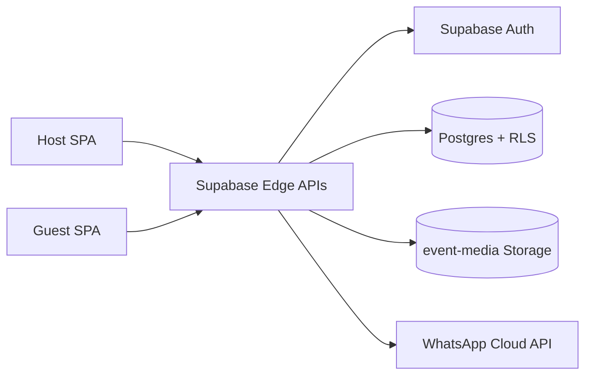

# Invana

Invana is a mobile-first platform for creating premium digital invitations and
bio cards, exporting print-ready PNG/PDF files, publishing RSVP websites, and
sharing invitations through WhatsApp.

| Mode | Behavior |
|------|----------|
| **Demo** | Browser-local drafts/RSVPs, compressed data-URL photos, and `wa.me` shares; no backend required |
| **Connected** | Supabase email/password Auth, Postgres + RLS, Storage, Edge APIs, and optional WhatsApp Cloud API |

Production site: **https://invana.stream**

---

## What is implemented

- Invitation and bio-card creation with configurable event/card types.
- Original, data-driven SVG templates with theme customization and live preview.
- Photo slots with center cover-crop in builder, public invite, PNG, and PDF.
- Client-side photo compression, a 2 MB stored-object limit, and long-lived CDN caching.
- Automatic Storage cleanup when photos are replaced/removed or an event is deleted.
- PNG and PDF export with Storage photos embedded for reliable downloads.
- Public invitation URLs, QR codes, RSVP submission, and host RSVP dashboards.
- Demo Mode for zero-config use and Connected Mode for durable multi-device data.
- Guest draft/media promotion after sign-in.
- Email/password sign-in and account creation through Supabase Auth.
- WhatsApp `wa.me` sharing and optional WhatsApp Cloud API functions.
- Phase 1 APIs for invite reads, RSVP writes, media, event publishing, and OG metadata.
- Row Level Security, owner-scoped Storage writes, request IDs, and rate limiting.

---

## Prerequisites

- Node.js 20+ and npm
- A Supabase project only for Connected Mode

## Run locally

```bash
git clone <repository-url>
cd invana
npm install
npm run dev
```

Open **http://127.0.0.1:5173/** (or the URL printed by Vite). For a fixed host:

```bash
npm run dev -- --host 127.0.0.1 --port 5173
```

Create local configuration with `cp .env.example .env`. Leave the two Supabase
variables empty for Demo Mode. Never put service-role or WhatsApp secrets in
`VITE_*`; Vite exposes those variables to the browser.

## Commands

| Command | Purpose |
|---------|---------|
| `npm run dev` | Start the development server |
| `npm run build` | Type-check and build production assets |
| `npm run preview` | Serve the production build |
| `npm run typecheck` | Validate TypeScript |
| `npm run lint` | Run ESLint with zero warnings |
| `npm test` | Run Vitest tests |

---

## Product flow

1. **Create** — invitation (default Wedding) or card  
2. **Template** — pick a composition  
3. **Builder** — fields, theme, live SVG preview  
4. **Download** — PNG / PDF (Connected: durable HTTPS photos after sign-in)  
5. **Publish** — public `/invite/:slug` RSVP site  
6. **Share** — WhatsApp (`wa.me` or Cloud API)  
7. **RSVP** — guests respond; host sees them on **My events**

---

## Architecture (summary)

Invana is a **host → invite → guest** product. The static SPA never holds
privileged secrets. Supabase provides managed identity, Postgres, Storage, and
Edge Functions; adapters keep Demo and Connected Mode behind common contracts.

```
RenderInput (fields + templateId + theme)
        │
        ├─ Composition (SVG) → preview, PNG, PDF
        └─ InvitePage → public RSVP site
```


```mermaid
flowchart LR
  Host[Host SPA] --> Edge[Supabase Edge APIs]
  Guest[Guest SPA] --> Edge
  Edge --> Auth[Supabase Auth]
  Edge --> DB[(Postgres + RLS)]
  Edge --> Storage[(event-media Storage)]
  Edge --> WhatsApp[WhatsApp Cloud API]
```

Connected Mode uses the Phase 1 services `invite`, `rsvp`, `media`, `events`,
and `og-invite`, plus optional WhatsApp functions. The frontend keeps provider
contracts: `PersistenceProvider`, `StorageProvider`, `AuthProvider`, and
`MessagingProvider`.

**Invariants**

- Publish/export image fields are durable HTTPS Storage URLs in Connected Mode.
- Photos are compressed before upload, cover-cropped without stretching, and
  removed from Storage when replaced or when their event is deleted.
- Connected RSVP writes to the cloud system of record; failures never silently
  become local-only successes.
- Demo Mode stays fully local.

Full design (actors, APIs, ownership, phases, defaults): **[docs/architecture.md](docs/architecture.md)**.

---

## Documentation

| Doc | Contents |
|-----|----------|
| **[docs/architecture.md](docs/architecture.md)** | Backend/FE architecture — source of truth |
| **[docs/deployment.md](docs/deployment.md)** | Netlify / Vercel / Pages / Cloudflare |
| **[docs/whatsapp.md](docs/whatsapp.md)** | WhatsApp Cloud API Edge setup |
| **[supabase/README.md](supabase/README.md)** | Migrations, RLS, Storage, Edge deploy |
| **[REQUIREMENTS.md](REQUIREMENTS.md)** | Product requirements |

---

## Environment

Frontend-only keys (never put service-role or WhatsApp tokens in `VITE_*`):

```bash
VITE_SUPABASE_URL=
VITE_SUPABASE_PUBLISHABLE_KEY=
VITE_MESSAGING_MODE=            # unset | wa_me | cloud | demo
VITE_PUBLIC_SITE_URL=https://invana.stream
VITE_REQUIRE_SIGN_IN=true       # Download gate in Connected Mode
VITE_GA_MEASUREMENT_ID=         # optional GA4
```

---

## Enable Connected Mode

1. Create a Supabase project.  
2. Apply migrations in order — see [supabase/README.md](supabase/README.md).  
3. Deploy Edge Functions: `invite`, `rsvp`, `media`, `events`, `og-invite` (+ WhatsApp if needed).  
4. Enable the Supabase Email provider for email/password auth.
5. Set `VITE_SUPABASE_URL` + `VITE_SUPABASE_PUBLISHABLE_KEY` (+ `VITE_PUBLIC_SITE_URL`).  
6. Restart `npm run dev` → adapters switch to Connected.  
7. Sign in before cloud Save / Publish / Share.  
8. Optional: `VITE_MESSAGING_MODE=cloud` after [WhatsApp setup](docs/whatsapp.md).

Until Edge Functions are deployed, the SPA falls back to PostgREST / direct Storage for invite, RSVP, and uploads.

---

## Supabase media behavior

- Public-read bucket: `event-media`.
- Object path: `{userId}/{eventId}/{mediaId}.{ext}`.
- JPEG, PNG, WebP, and GIF inputs are downsized and generally encoded to
  WebP/JPEG before upload.
- Stored objects are capped at 2 MB by client preparation, Media Edge, and the
  Storage bucket migration.
- Replacing/removing a photo deletes the old object; deleting an event removes
  its known objects before database cascade deletion.
- Immutable object names use a one-year CDN cache. Invite view and export use
  the same durable URL.

Existing Supabase projects should apply
`supabase/migrations/20260326000001_media_2mb.sql`.

## Repository layout

```text
src/
  api/                  Event create/save/publish/delete facade
  auth/                 Session provider and sign-in gates
  components/           Builder, preview, invitation, layout, and UI
  config/               Event/card types and themes
  lib/                  Rendering, export, media, validation, SEO
  pages/                Route-level pages
  services/             Demo and Supabase adapters
  services/api/         Edge Function clients
  templates/            Template registry, fields, and layout factory
supabase/
  functions/            Logical APIs and WhatsApp functions
  migrations/           Schema, RLS, Storage, and Phase 1 migrations
docs/                   Architecture, deployment, and WhatsApp docs
```

---

## Hosting

| Target | Notes |
|--------|--------|
| **Netlify** (production) | https://invana.stream — SPA fallback in `netlify.toml` |
| **Vercel** | `vercel.json` rewrites — [docs/deployment.md](docs/deployment.md) |
| **GitHub Pages** | Legacy; hash links migrate to path URLs |

App uses **BrowserRouter** (`/invite/:slug`). Old `/#/invite/...` links are redirected.

---

## Stack

| Area | Technology |
|------|------------|
| UI | React 18, TypeScript 5, Tailwind CSS 3 |
| Build | Vite 5 |
| Routing | React Router 6 (`BrowserRouter`) |
| Forms/state | React Hook Form, Zod, Zustand |
| Rendering/export | SVG compositions, Canvas, jsPDF, qrcode |
| Backend | Supabase Auth, Postgres, RLS, Storage, Edge Functions |
| Messaging | WhatsApp `wa.me` and optional WhatsApp Cloud API |
| Quality | Vitest, ESLint, TypeScript |
| Hosting | Netlify production; Vercel/Cloudflare-compatible SPA |

Templates are original Invana compositions (see each template’s `license` metadata).

## Troubleshooting

- **Sign in is missing:** set both Supabase frontend variables and restart Vite.
  Demo Mode exposes `/signin` with setup guidance.
- **Storage is empty:** sign in, add a photo, and save. Demo Mode intentionally
  keeps photos in the browser.
- **Upload is rejected:** apply Storage migrations and verify `event-media`
  exists with owner write policies. Stored photos must be at most 2 MB.
- **A production deep route returns 404:** configure the included SPA fallback
  (`netlify.toml` or `vercel.json`).

## Security

Do not commit `.env`, service-role keys, WhatsApp tokens, or production secrets.
Report security issues privately to the repository owner.
