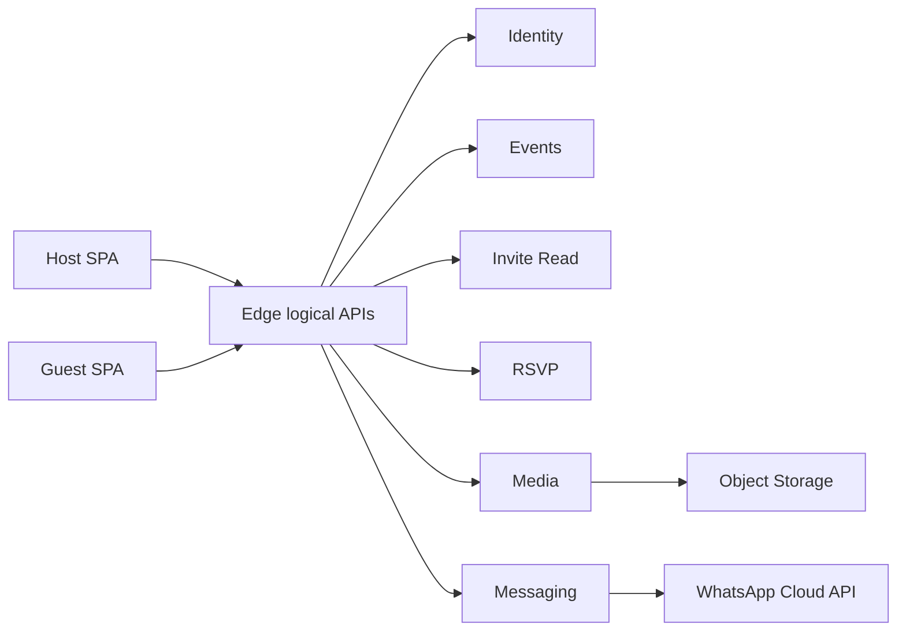

# Architecture

Invana backend and frontend architecture as shipped on `develop` (Phase 0–1).  
For local setup and env vars, see the [README](../README.md). Ops detail: [supabase/README.md](../supabase/README.md).

---

## Product reality

Invana is a **host → invite → guest** product, not generic CRUD SaaS.

| Actor | Needs from backend |
|-------|-------------------|
| **Signed-in host** | Persist drafts/published events (`config` = `RenderInput`), upload photos, publish slug, see RSVPs, share via WhatsApp |
| **Browser-session host** (Connected, signed out) | Edit locally; no durable cloud state until auth; on sign-in, promote draft + re-upload local media |
| **Guest** | Load published invite by slug; submit RSVP; load public media |
| **Host download** | PNG/PDF embed the **same durable photo URLs** as the live invite (not `blob:`) |

Canonical model:

```
RenderInput = fields + templateId + theme (+ sections)
        │
        ├─ Composition (SVG) → preview, PNG, PDF
        └─ InvitePage → public RSVP site
```

The backend stores that JSON; it does not re-implement template layout.

---

## Design principles

1. **Bounded contexts** — split by write ownership and failure domains, not one service per table.  
2. **Shared-nothing data ownership** — one system of record per aggregate.  
3. **Public vs privileged APIs** — guest paths anonymous + rate-limited; host paths require JWT.  
4. **Durable media first** — publish/export image fields are HTTPS object URLs, never `blob:` / `data:` in Connected Mode.  
5. **Sync for UX; async for fan-out** — invite GET and RSVP insert stay sync; WhatsApp bulk, webhooks, email can be async.  
6. **Evolve from Supabase** — logical Edge services first; extract deployables when needed.  
7. **Keep FE adapters** — `PersistenceProvider` / `StorageProvider` / `AuthProvider` / `MessagingProvider` remain the client contracts.

---

## Frontend boundary

Static SPA (Netlify / Vercel / Cloudflare). Browser never holds WhatsApp tokens or service-role keys.

### Adapters

| Interface | Demo Mode | Connected Mode |
|-----------|-----------|----------------|
| `PersistenceProvider` | `localStorage` | PostgREST `events` / `rsvps` (host CRUD) |
| `AuthProvider` | local demo user | Supabase Auth (magic link) |
| `MessagingProvider` | `wa.me` | `wa.me` default; Cloud API when `VITE_MESSAGING_MODE=cloud` |
| `StorageProvider` | durable data URLs | Media Edge (preferred) or Storage `event-media`; promote on Save/claim |

Selection: `src/services/index.ts` → Demo when Supabase env is unset.

Public guest paths prefer Edge clients in `src/services/api/*` (`invite`, `rsvp`) with PostgREST fallback if functions are not deployed.

### Auth & session

| Mode | Behavior |
|------|----------|
| **Signed-in** | JWT on host mutations; RLS / service-enforced `user_id` |
| **Browser-session only** | Local draft OK; Publish / Share / Download gated; no silent cloud write as `unauthenticated` |
| **Guest** | Invite + RSVP only |
| **Promotion on sign-in** | Rebind `userId`; upload `blob:`/`data:` fields to Media; upsert Events |

Download gate in Connected Mode: `VITE_REQUIRE_SIGN_IN` (default `true`). Demo Mode never gates.

### Routing

**BrowserRouter** path URLs (`/invite/:slug`). Legacy hash links (`/#/…`) migrate in `src/main.tsx`. Production SPA fallback: `netlify.toml` / `vercel.json`.

### Repo layout (actual)

```
src/
  api/                 # events facade (create/save/publish/claim)
  auth/                # session + sign-in gate
  components/          # editor, invitation, seo, ui, templates
  config/              # event types, card types, themes
  lib/                 # export, mediaUrl, durableMedia, render, slug, supabase
  pages/
  seo/
  services/            # providers + demo / supabase adapters
  services/api/        # Edge logical API clients
  templates/
  types/
supabase/
  migrations/
  functions/           # invite, rsvp, media, events, og-invite, whatsapp-*
  functions/_shared/   # CORS, request IDs, rate limit, slug, projection
```

---

## Logical services (Phase 1)

| Service | Responsibility | Sync / async | Data owned | Edge Function |
|---------|----------------|--------------|------------|---------------|
| **Identity** | Signup/signin, JWT, profile | Sync | `profiles` | Supabase Auth |
| **Events** | Draft/publish, slug, `config` SoR | Sync | `events`, `themes` | `events` (publish/unpublish) |
| **Invite Read** | Public GET by slug | Sync | — (projection) | `invite` |
| **RSVP** | Guest insert; host list | Sync write; async notify later | `rsvps`, questions/answers | `rsvp` |
| **Media** | Upload, metadata, URL policy | Sync upload | `event_media` + bucket | `media` |
| **Messaging** | Cloud send, webhooks | Sync enqueue; async send | `message_*` | `whatsapp-send`, `whatsapp-webhook` |
| **OG** | Crawler HTML shell | Sync | — | `og-invite` |
| **Jobs** | Bulk send, email, OG/export | Async | `outbox_events` / queue | *(consumer later)* |
| **Export** | Server PNG/PDF *(optional)* | Async | `exports` | Client `lib/export.ts` today |

### Product API surface

Mapped to `/functions/v1/<name>` today. Treat these as the product API for future BFF extraction.

**Host (JWT)**

- `GET/POST/PATCH/DELETE /v1/events…`
- `POST /v1/events/{id}/publish` · `POST …/unpublish`
- `GET /v1/events/{id}/rsvps` · `GET /v1/rsvps?eventIds=`
- `POST /v1/media/uploads`
- `POST /v1/messaging/campaigns` · `POST …/send`
- `GET /v1/me`

**Public (anon + rate limit)**

- `GET /v1/invites/{slug}` → published projection  
- `POST /v1/invites/{slug}/rsvps` → insert only  
- Media via public bucket / CDN  

**System**

- `POST /v1/webhooks/whatsapp`  
- Internal job workers (not browser-callable)

Host CRUD may still use PostgREST behind `PersistenceProvider` in Phase 1.

### Topology



### Key flows

**Signed-in host:** upload → Media (HTTPS URL) → write into `config.fields` → Events publish → client Composition fetches HTTPS for PNG/PDF.

**Browser-session host:** local draft + data URLs → preview OK → sign-in promotes media → then same as signed-in. Publish/share blocked until signed in.

**Guest:** `GET invite` → published config + HTTPS media → `POST rsvp` → optional outbox (`rsvp.created`).

---

## Media

- Bucket: **public-read** `event-media` (Phase 1 default).  
- Path: `{userId}/{eventId}/{id}.ext`.  
- Writes: owner-only; MIME/size validation at Media Edge (10 MB; jpeg/png/webp/gif).  
- `event_media` is metadata SoR; binaries never in Postgres.  
- **Invariant:** after save-for-publish, every image field in `config` is a durable HTTPS URL. Invite and export both use it. Export inlines images as data URLs at rasterize time so Storage CORS does not drop photos from PNG/PDF.

---

## Invite & RSVP

- Slug uniqueness global; normalize on write; conflict → 409.  
- RSVP insert only when `status=published`.  
- Guests cannot `SELECT` other RSVPs (insert without `.select()`).  
- Connected Mode: cloud is SoR — **fail closed** (surface errors; no silent local success).  
- Demo Mode: local-only RSVP is OK.

---

## Data ownership

| Aggregate | Owner | Others may |
|-----------|-------|------------|
| User/profile | Identity | Read `user_id` |
| Event + slug + config | Events | Invite reads published projection; RSVP holds `event_id` |
| Media object + metadata | Media | Events stores URL strings in `config` |
| RSVP (+ answers) | RSVP | Events does not embed RSVP arrays |
| Campaigns / logs | Messaging | References `event_id`, `guest_id` |

No dual SoR for the same RSVP or the same media bytes.

---

## Observability

- Structured logs + `x-request-id` on Edge responses.  
- Product events (partial): `invite_view`, `rsvp_submit`, `media_upload` (Edge logs); FE GA for template/preview/download.  
- Rate limits on public `invite` / `rsvp` / `og-invite` via `api_rate_buckets` (service role; fail-open if migration missing).

---

## Phased migration

| Phase | Status | Focus |
|-------|--------|--------|
| **0** | Done | Cloud RSVP SoR; durable media before publish; Demo Mode local |
| **1** | Done | Edge `invite` / `rsvp` / `media` / `events` / `og-invite`; request IDs; rate limits; `outbox_events` |
| **2** | Later | Dedicated BFF; extract Messaging / Media workers |
| **3** | Only if needed | Independent deployables; server Export |

**Non-goals (early phases):** rewrite Composition into the backend; custom auth server; one microservice per SQL table; dropping Demo Mode adapters.

### Today → target

| Today | Target |
|-------|--------|
| `supabasePersistence` | Events + RSVP services |
| `supabaseStorage` / Media Edge | Media service |
| `supabaseAuth` | Identity (keep Supabase) |
| `whatsapp-*` | Messaging service |
| `lib/export.ts` | Remains default; Export service optional |
| `resolveEventBySlug` / `addPublicRsvp` | Invite Read + RSVP public APIs |

---

## Defaults (resolved for Phase 1)

| Topic | Choice |
|-------|--------|
| Media visibility | Public bucket |
| Download gate | Sign-in required in Connected Mode |
| Server export | Deferred — client PNG/PDF + durable URLs |
| BFF host | Supabase Edge only |
| RSVP notifications | Dashboard-only; outbox rows written, no email worker |
| OG | `og-invite` Edge landed; CDN/bot proxy wiring later |

---

## Related docs

- [Deployment](deployment.md)  
- [WhatsApp](whatsapp.md)  
- [Supabase ops](../supabase/README.md)  
- [Product requirements](../REQUIREMENTS.md)  
